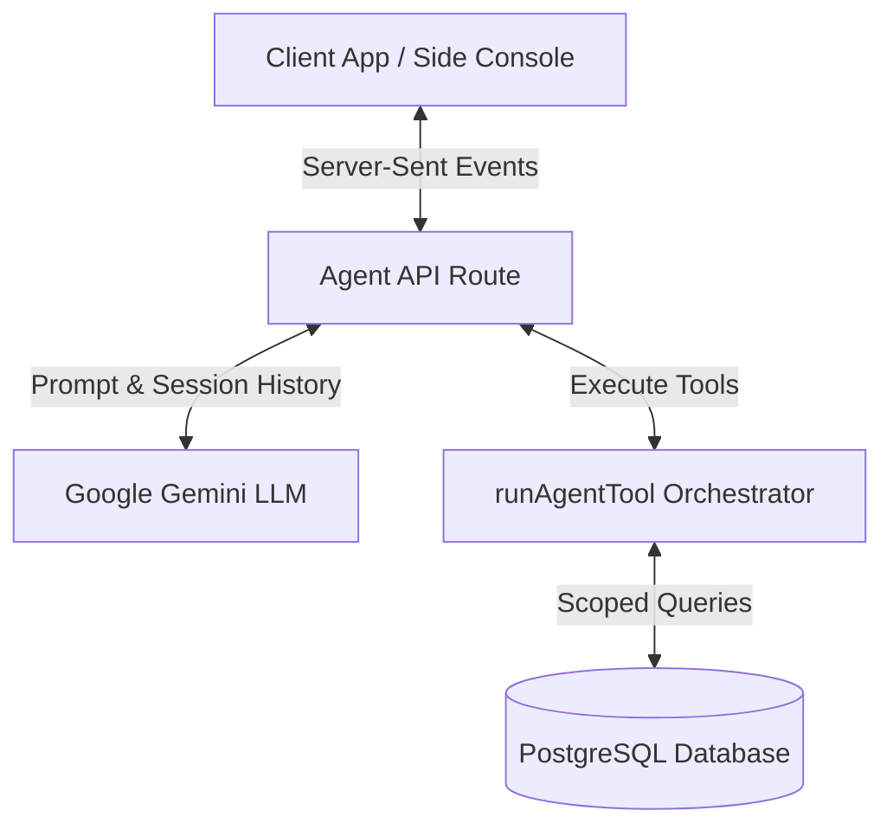

# Darex AI Operations Platform

This is a multi-tenant business operations platform featuring a CRM, AI Agent, Unified Inbox, and Workflow Automation. It is built as a Next.js evaluation project.

## Stack
- **Framework**: Next.js 14 (App Router)
- **Language**: TypeScript
- **Database**: PostgreSQL (Prisma ORM)
- **Styling**: Tailwind CSS
- **Authentication**: NextAuth.js
- **AI**: Gemini API

---

## 🏗️ Architecture Explanation

The Darex AI Operations Platform is engineered with a modular, highly secure, and explainable AI architecture. For a comprehensive walkthrough, please refer to the detailed [PROJECT_DOCUMENTATION.md](file:///c:/PROJECTS/DAREXai_INTERN/PROJECT_DOCUMENTATION.md).



### 1. Secure Database Multi-Tenancy Scoping
To guarantee absolute data boundaries between customers without manual where-clause checks in every route, we implement a centralized Prisma query extension hook in [prisma.ts](file:///c:/PROJECTS/DAREXai_INTERN/src/lib/prisma.ts):
- It intercepts database queries at runtime and appends `where: { tenantId }` to every select query.
- It dynamically injects the active tenant ID into all write operations, ensuring no tenant can access or overwrite another tenant's records.

### 2. Dual-Layer Route Protection
- Protected client-side pages and API routes are gated server-side in [middleware.ts](file:///c:/PROJECTS/DAREXai_INTERN/middleware.ts).
- Requests lacking a valid session token are redirected instantly at the edge, preventing protected data compilation or server-side rendering leaks.

### 3. Explainable AI Tool Orchestration
- Outbound responses use Gemini native function-calling. When a user asks the agent to perform a business task, the server runs the function locally, logs the operations to `AuditLog`, and pipes the results back to Gemini.
- Reasoning explainability is guaranteed by instructing the model to prefix recommendations with a `"Why: [reasoning]"` block.
- A local keyword heuristic router provides a fail-safe fallback in case of rate-limiting, ensuring system metrics and contact updates remain fully operable.

---

## Key Features & Security Model

### 1. Authentication & Multi-Tenancy
- Identity handshake is handled via Google OAuth (PKCE) in NextAuth.js.
- Post-handshake, a custom token-exchange route (`/api/auth/exchange`) issues short-lived Access JWTs (15 minutes) and rotated Refresh JWTs (7 days) stored in `httpOnly` secure cookies.
- All database queries are automatically scoped by `tenantId` via a custom Prisma `$extends` query hook (`src/lib/prisma.ts`). The tenant ID is always resolved server-side from the verified JWT session.

### 2. CRM & Automation
- CRUD endpoints and UI tables for managing Contacts and Opportunities.
- Workflow automation that handles scoring prompts and lead qualification.
- Unified Inbox displaying seeded customer messages with sentiment and intent classification.

### 3. AI Agent
- An intelligent side-agent using Gemini native tool-calling (function calling) to trigger CRM CRUD operations, retrieve metrics, and interact with mock external channels.
- Reasoning explainability: The agent prefixes its answers with a "Why" block explaining its reasoning.

### 4. WhatsApp Sandbox Integration
- Flat and nested official-spec Meta Cloud API webhook parsing in `/api/webhooks/whatsapp`.
- A fallback mock sandbox interface is provided at `/api/mock/whatsapp` for local testing.

---

## Local Development Setup

### Prerequisites
- Node.js (v18+)
- Local PostgreSQL instance (or Docker)

### Setup Steps
1. Install dependencies:
   ```bash
   pnpm install
   ```
2. Set up environment variables:
   ```bash
   cp .env.example .env
   ```
   Add your `GOOGLE_CLIENT_ID`, `GOOGLE_CLIENT_SECRET`, and `GEMINI_API_KEY`.
3. Apply database migrations:
   ```bash
   npx prisma migrate dev
   ```
4. Seed the database with demo records:
   ```bash
   npx prisma db seed
   ```
5. Run the local dev server:
   ```bash
   pnpm dev
   ```
   Access the app at `http://localhost:3000`.

---

## Testing
Run the test suite (Vitest):
```bash
pnpm test
```

---

## Data Model & Schema Design Decisions

To ensure optimal multi-tenant isolation, clear audit trails, and efficient AI querying, the database schema (built using PostgreSQL + Prisma) incorporates the following design decisions:

### Core Entities

1. **Tenant**
   - The central anchor of the multi-tenant architecture. All user access, contacts, opportunities, conversations, messages, and tokens are hard-linked to a specific `Tenant` ID.
   - Includes custom `onboardingJson` to persist tenant-specific business profile context (business goals, industry, target customer) used by the AI Agent.

2. **User**
   - Belongs to a single `Tenant`. Contains identity details resolved during OAuth login.
   - Constrained by a unique index `@@unique([tenantId, email])` to enforce that user accounts are isolated per tenant boundary.

3. **Contact & Opportunity**
   - Represents the core CRM records.
   - Opportunities are linked to Contacts (using a `SetNull` delete rule to prevent orphan opportunities if contacts are removed).
   - Features `qualificationScore` and `nextBestAction` columns to store AI scoring and recommendations directly on the records.

4. **ChatConversation & ChatMessage**
   - Persists the AI Chatbot's session state.
   - `ChatMessage` records include `toolName` and `toolPayload` metadata columns. This is a critical design decision allowing the UI to audit and render exactly what tools (e.g., `send_whatsapp`) the AI triggered during the conversation.

5. **RefreshToken**
   - Implements refresh token rotation security. Includes fields like `familyId`, `tokenHash`, `revokedAt`, and `replacedById` to track the token tree and detect reuse immediately.

6. **AuditLog**
   - Captures telemetry logs for security audit gates. Stores the action, userId, IP, user agent, and a JSON `metadata` payload detailing the exact state changes (e.g. lead qualification scoring outputs).

7. **Message**
   - Represents the Unified Inbox communication timeline.
   - Incorporates `MessageType` (WhatsApp, Email, Call logs) and indexes (`@@index([tenantId, type])`) for high-performance timeline queries.
   - Stores AI-generated `sentiment`, `intent`, and `summary` columns populated during ingestion.

---

## Out of Scope / Cuts
The following features are intentionally out of scope for this evaluation project:
- Production WAF, SOC2 compliance, or DDoS mitigation.
- Automated CI/CD pipelines (excluding standard Vercel deployments).
- Database read-replicas, partitioning, or serverless scaling.
- Voice AI / phone call automation.

