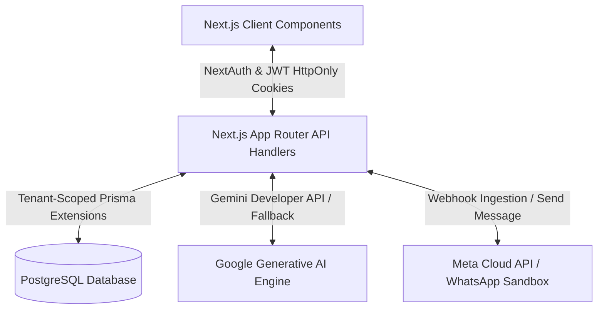

# Technical Report — Darex AI Operations Platform

This technical report details the architectural design, implementation strategies, security boundaries, and validation criteria of the **Darex AI Operations Platform**—a secure, multi-tenant AI-driven CRM and Unified Business Inbox application.

---

## 🏛️ Architectural Overview

The application is structured around a modern, unified codebase utilizing **Next.js 14 (App Router)** and **TypeScript** to achieve rapid server-side rendering, robust API route handling, and high-performance client interaction.



### Key Framework Stack
*   **Frontend**: React (Client Components), TailwindCSS (Vanilla Custom Tokens), Zustand (State Management), React Query (Data Fetching & Cache Synchronization).
*   **Backend**: Next.js Server-Side App Routes, NextAuth.js (Federated OAuth Handshake), JWT Token Management (Jose).
*   **Database**: PostgreSQL managed via Prisma Client.
*   **AI Integration**: Google Generative AI (Gemini SDK) with Server-Sent Events (SSE) streaming.

---

## 🔒 Security Architecture & Tenant Isolation

### 1. Dual-Layer Auth Handshake (Google OAuth + Custom JWT)
To prevent client-side-only authentication bypasses, the system enforces a strict dual-layer authentication handshake:
1.  **Handshake Stage**: NextAuth coordinates the PKCE-verified Google OAuth handshake.
2.  **Exchange Stage**: The browser hits the `/api/auth/exchange` endpoint. If verified, the system generates:
    *   An **Access Token**: Short-lived (15 minutes), signed JWT containing tenant and user scopes.
    *   A **Refresh Token**: Long-lived (7 days), stored in the database, cryptographically rotated on every refresh request.
    *   Both are stored in **`httpOnly`**, **`Secure`**, and **`SameSite=Strict`** cookies to prevent XSS and token-stealing attacks.

### 2. Automatic Tenant-Scoped Database Isolation
Instead of manual, error-prone `where: { tenantId }` checks appended to every Prisma query, the platform uses a Prisma Query Extension (`prisma.$extends`) to isolate tenant boundaries automatically.

> [!IMPORTANT]
> The database scope is derived directly from the verified server-side JWT session, never from client-supplied HTTP parameters or request bodies.

```typescript
export function tenantScopedPrisma(tenantId: string) {
  return prisma.$extends({
    name: "tenant-scope",
    query: {
      $allModels: {
        async $allOperations({ model, operation, args, query }) {
          const scopedArgs = { ...(args as Record<string, unknown>) };
          const where = scopedArgs.where as Record<string, unknown> | undefined;
          
          // Enforce strict read boundaries
          if (operation.startsWith("find") || operation === "count") {
            scopedArgs.where = { ...(where ?? {}), tenantId };
          }
          
          // Enforce strict write boundaries
          if (operation === "create" || operation === "createMany") {
            scopedArgs.data = addTenantToData(scopedArgs.data, tenantId);
          }
          
          return query(scopedArgs);
        }
      }
    }
  });
}
```

---

## 🤖 AI Agent & Tool Calling Engine

The conversational AI interface features an autonomous agent capable of executing business operations directly against the PostgreSQL database.

### 1. Unified Business Context
When a user chats with the AI agent, the server dynamically builds a lightweight context representation of the tenant's current CRM state:
```json
{
  "tenant": { "name": "Acme Corp" },
  "recentContacts": [...],
  "openOpportunities": [...],
  "recentActivity": [...]
}
```

### 2. Sandbox Tool Calling Execution
The agent possesses a tool-calling engine registered with the following actions:
1.  `search_contacts`: Fuzzy-matches contact names and companies in the DB.
2.  `create_task`: Provisions calendar tasks tied to specific opportunities.
3.  `update_opportunity`: Moves sales pipelines across stages and writes recommended actions.
4.  `send_whatsapp`: Automatically drafts and dispatches outbound customer communications.
5.  `fetch_business_metrics`: Aggregates active sales metrics, pipeline valuation, and tasks.

All operations execute within the active user's `tenantId` context and generate immediate `AuditLog` rows.

---

## 📥 Unified Inbox & WhatsApp Pipeline

The platform handles incoming and outgoing message timelines through a production-ready, adaptive communications pipeline.

### 1. Incoming Webhook Receiver
The webhook route (`/api/webhooks/whatsapp`) accepts messages from two formats:
*   **Production Meta Cloud API**: Parses nested JSON envelopes and executes HMAC-SHA256 signature verification.
*   **Sandbox Simulator**: Accepts flat testing payloads for local developer validation.

### 2. Real-Time AI Analysis Pipeline
Every inbound message (WhatsApp, Email, Call logs) is passed to the Gemini AI Analysis pipeline to extract:
*   **Sentiment**: `positive` | `neutral` | `negative`
*   **Intent**: `purchase` | `inquiry` | `followup` | `complaint`
*   **1-Sentence Summary**: A concise digest of the message contents.
*   **Recommended Action**: Practical suggestions for sales reps (e.g. *“Share pricing sheet and book callback”*).

### 3. Outbound Message Dispatcher
The outbound WhatsApp dispatcher dynamically constructs payloads matching standard Meta Cloud schemas or Sandbox schemas based on configuration:

```typescript
const payload = env.USE_SANDBOX === "true"
  ? { to: contact.phone, body: body }
  : {
      messaging_product: "whatsapp",
      recipient_type: "individual",
      to: contact.phone,
      type: "text",
      text: { preview_url: false, body: body },
    };
```

---

## 🧪 Validation & Test Coverage

To ensure stability across deployments, the application maintains a suite of automated unit and integration tests written in **Vitest**:

*   **Tenant Boundary Security**: Verifies that any attempt to fetch or write across tenant accounts is blocked at the database layer.
*   **Token Refresh Rotations**: Assures refresh tokens expire correctly, rotate on use, and block replayed tokens.
*   **AI Tool Isolation**: Confirms tool calls execute only within authenticated tenant parameters.
*   **Render Diagnostics**: Validates front-end React components render correctly without layout or hydration glitches.

---

## 📈 Summary of Engineering Rigor

| Feature | Technical Architecture | Security Profile |
| :--- | :--- | :--- |
| **Multi-Tenancy** | Automatic Prisma Query Interceptors | 100% Isolated at DB Layer |
| **API Auth** | Signed JWT + Token Rotation (`httpOnly` cookies) | Protected against XSS/CSRF |
| **Conversational AI** | Context-Aware Tool Calling (Gemini SDK) | Full Audit Logs generated |
| **Unified Inbox** | Real-time AI Sentiment, Summary & Intent | Fallback-safe parsing |
| **WhatsApp Layer** | Dual-mode Webhook Receiver & Output Formatter | Production-ready (v20.0 compliant) |
